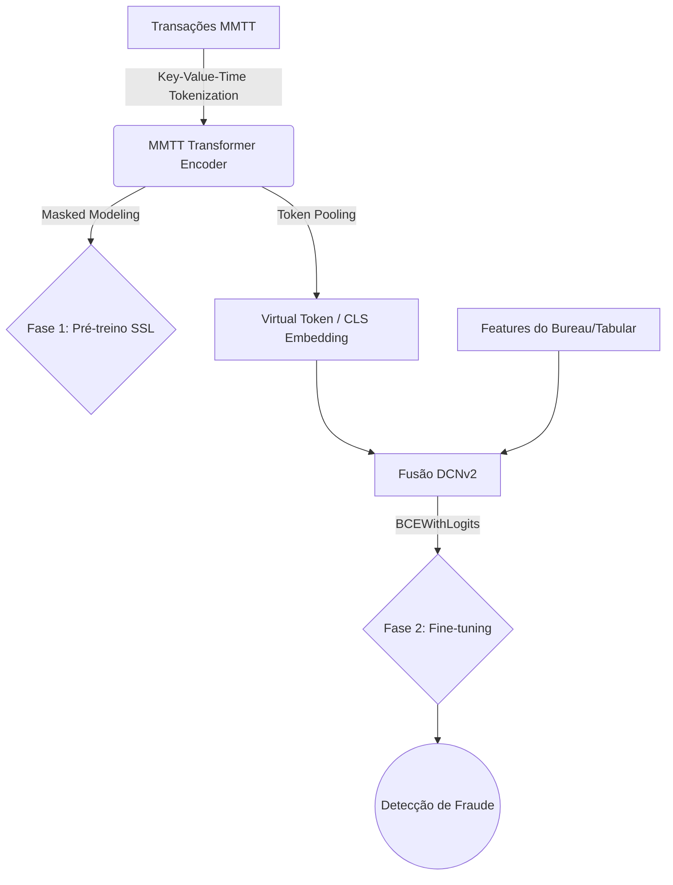

# Large Data Models (LDMs) Research Lab


Bem-vindo ao LDM Research Lab! Este repositório é uma plataforma corporativa e educacional projetada para pré-treinar (Self-Supervised) e especializar (Fine-Tuning) **Foundation Models para dados estruturados e transacionais**. 

Enquanto LLMs (como GPT ou Claude) dominam a linguagem natural, os **LDMs (Large Data Models)** compreendem nativamente sequências numéricas, tabulares e temporais sem destruir a precisão matemática.

> 🇧🇷 **Documentação em Português Disponível!** 
> Para a equipe técnica brasileira, disponibilizamos guias didáticos completos sobre a teoria e a prática na pasta `/docs`.

---

## 🚀 Quick Start (Rodando seu primeiro modelo)

Se você não possui dados reais em mãos, não se preocupe. O repositório vem com um gerador de dados sintéticos completo.

### 1. Instalação
O projeto pode ser instalado localmente ou via Docker (recomendado para GPU).

**Local:**
```bash
# Clone o repositório
git clone <url-do-repo>
cd Large-Data-Models-LDMs-

# Instale em modo editável (requirements já inclusos no setup)
pip install -e ".[viz,tracking]"
```

**Docker:**
```bash
docker build -t ldm-research -f docker/Dockerfile .
docker run --gpus all -it ldm-research
```

### 2. Rodando o Pipeline Completo
O comando abaixo irá:
1. Gerar milhares de transações financeiras realistas (fraudáveis).
2. Fazer o **pré-treinamento** não-supervisionado usando o objetivo LimiX.
3. Fazer o **fine-tuning** para classificação binária (Fraude) usando DCNv2.
4. Salvar os resultados, checkpoints e relatórios em `results/`.

```bash
# Execução rápida (CPU ou para testes de sanidade - 2 minutos)
python src/main.py --config small

# Execução completa corporativa (GPU recomendada)
python src/main.py --config default
```

Após o fim da execução, abra o arquivo `results/metrics_report.md` para ver o AUC, F1-Score e outras métricas.

---

## 🧠 Arquitetura e Conceitos Principais

A arquitetura do LDM baseia-se no estado-da-arte (TransactionGPT, PRAGMA, LimiX):



1. **Tokenização KVT (Key-Value-Time)**: Transações não são texto. KVT separa a Categoria (embedding discreto), Valor (normalizado escalar) e Tempo (delta quantizado).
2. **Pré-treinamento Masked Joint-Distribution (LimiX)**: Esconde partes heterogêneas dos dados. O modelo aprende a estrutura comportamental preenchendo as lacunas, sem precisar de rótulos humanos.
3. **Fusão Polinomial (DCNv2)**: Para fine-tuning, fundimos as representações profundas do Transformer com *features* estáticas antigas (ex: Score do Serasa) usando interações matemáticas explícitas.

---

## 📚 Trilha de Aprendizado (Para a Equipe)

Preparamos uma documentação passo-a-passo para garantir o nivelamento técnico de todos os envolvidos na iniciativa LDM.

Recomendamos a leitura na seguinte ordem:

1. 📖 [Fundamentos: O que são LDMs e por que não usar LLMs?](docs/01_fundamentos_ldm.md)
2. 🧱 [Arquitetura MMTT: Tokenização Key-Value-Time](docs/02_arquitetura_mmtt.md)
3. 🕵️‍♂️ [Pré-treinamento: Como o modelo aprende sozinho (LimiX)](docs/03_pretraining_limix.md)
4. ⚙️ [Fine-tuning: Unindo Transformers e Features Clássicas (DCNv2)](docs/04_finetuning_dcnv2.md)
5. 🛡️ [Avaliação e Robustez: Defesa contra atacantes e AUC](docs/05_avaliacao_robustez.md)
6. 🔬 [Referências e Literatura Acadêmica Oficial](docs/references.md)

---

## 📂 Estrutura do Repositório (Executável)

O código foi reestruturado de *conceitual* para um **Módulo Lightning End-to-End**.

*   `src/main.py`: Entrypoint único que orquestra todo o pipeline (Configurações via argparse).
*   `src/data/`: `LDMDataModule`, Tokenização MMTT, e gerador de dados sintéticos hiper-realista.
*   `src/models/`: Backbone do Transformer, Virtual Tokens, DCNv2, e o `LargeDataModel` principal.
*   `src/training/`: Objetivos SSL (NTP, LimiX) e `LightningModules` com suporte a mixed-precision.
*   `src/evaluation/`: Métricas resistentes a desbalanceamento (AUC, Flexible F1) e testes de stress Adversarial (FGSM).
*   `configs/`: Hyperparâmetros organizados em presets (`default` e `small`).

---

## ⚖️ Avisos de Segurança de Dados
Este repositório possui regras estritas em `.gitignore`. **Nunca faça commit de dados reais (`.csv`, `.parquet`) na pasta `data/`**. Utilize o `synthetic_generator.py` para debugar pipelines em infraestrutura externa segura.
