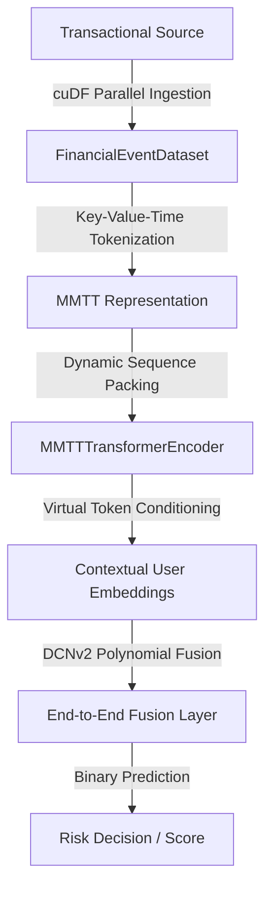

# Large Structured-Data Models (LDMs) Research Lab

An enterprise-grade repository and experimental playground for the ingestion, self-supervised pre-training, joint-fusion fine-tuning, and robust evaluation of **Large Structured-Data Models (LDMs)** applied to global transactional databases.

---

## 🌌 Architectural Overview & Core Paradigms

Traditional Machine Learning models struggle to comprehend the complex, relational, and highly-dimensional nature of transactional logs. This repository implements state-of-the-art architectures designed specifically to treat transactions as multi-modal events.



### 1. Multi-Modal-Temporal-Tabular (MMTT) Transformers
We model transaction histories not as raw text, but as chronological events containing high-cardinality categories, numerical scales, and descriptive text. 
* **Key-Value-Time (KVT) Tokenization**: Prevents loss of precision. Keys (column categories) are mapped using dimensional index dictionaries, values (continuous quantities) are quantized/scaled, and times are encoded through temporal delta embeddings.
* **Virtual Token Layer**: Prefixes sequence inputs with specialized latent dimensions (acting as continuous prompts). This fuses global user context (such as graph representations) and keeps self-attention complexity manageable without planifying metadata columns.

### 2. Masked Joint-Distribution Modeling (LimiX)
To learn stable schemas across static data profiles, the lab leverages a joint-distribution mask objective. 
* **Heterogeneous Mask Schedule**: Combines random cell-level, column-level, and temporal block-level masks. This forces the model to capture non-trivial cross-feature correlations, ensuring extreme robustness to missing transactional data (imputation).

### 3. Deep & Cross Network v2 (DCNv2) Fusion
For final binary adaptation (such as Credit Risk Classification), the contextual representation from the Transformer backbone is fused with classic tabular variables (like credit bureau scores). DCNv2 utilizes explicit polynomial matrix multiplication to cross-breed features efficiently without manual engineering.

### 4. Parameter-Efficient Fine-Tuning (PeFT) & Robustness
* **LoRA (Low-Rank Adaptation)**: Injected directly into the Self-Attention projection weights (`in_proj_weight`, `out_proj`) to enable immediate fine-tuning of multi-billion parameter backbones without catastrophic forgetting.
* **Strategic Shift Testing**: Simulates post-deployment evasion (Strategic Manipulation) using random data shifts and gradient-based adversarial perturbations (FGSM) on continuous inputs.

---

## 📂 Repository Structure

```directory
.
├── configs/
│   └── config.yaml             # Hydra declarative configurations (Model, Training, Benchmarks)
├── docker/
│   └── Dockerfile              # Development environment optimized for CUDA 12.1+ and MPI
├── src/
│   ├── data/
│   │   └── mmtt_dataset.py     # cuDF-accelerated dataset and Dynamic Sequence Packing Collate
│   ├── models/
│   │   ├── transformer_backbone.py  # MMTT Transformer Encoder & Virtual Token Layer
│   │   └── joint_fusion_network.py  # EndToEndFusionLayer using CrossNetworkV2 (DCNv2)
│   ├── training/
│   │   └── objectives.py       # NextTokenPredictionLoss & ContextConditionalMaskedLoss (LimiX)
│   └── evaluation/
│       ├── metrics.py          # Imbalanced F1-Score, AUC, and Imputation RMSE
│       ├── strategic_shift_tester.py # Adversarial Evasion FGSM Shifts & LoRA Injection
│       └── benchmarks.py       # Formal Testing Suite (V4FinBench, OpenML, TabArena, Adult)
├── requirements.txt            # Python dependencies
└── README.md                   # Repository documentation
```

---

## 🚀 Getting Started

### 1. Prerequisites & Container Setup
To leverage GPU acceleration via cuDF and compile custom FlashAttention CUDA kernels, it is highly recommended to run this repository inside the provided Docker environment.

```bash
# Build the Docker image
docker build -t ldm-research-lab -f docker/Dockerfile .

# Run the container mapping your GPU resources
docker run --gpus all -it -p 8000:8000 ldm-research-lab
```

### 2. Local Installation (Alternative)
Ensure you have CUDA 12+ and Python 3.10 installed on your host system:
```bash
pip install -r requirements.txt
```

---

## 📈 Running Benchmarks and Evaluation

The research lab includes a formal benchmarking suite to compare LDM performance against traditional gradient boosted trees (XGBoost) and zero-shot baselines.

Supported Datasets:
- **V4FinBench**: Evaluates multi-horizon corporate bankruptcy prediction under extreme class imbalance.
- **OpenML-CC18 / TabArena**: Benchmarks generalist zero-shot and few-shot tabular classification.
- **TALENT-REG**: Stability, regression, and mathematical interpretability testing.
- **Adult / Bank Marketing**: Evaluates OOD stability and strategic behavior manipulation.

To run the full suite:
```bash
python src/evaluation/benchmarks.py
```

---

## 📚 Academic & State-of-the-Art References

Our codebase aligns with modern foundational research in structured deep learning:
1. **TransactionGPT / 3D-Transformers**: Proponents of Key-Value-Time sequence alignment and the Virtual Token Layer structure for multi-modal payment data.
2. **PRAGMA**: Large-scale next-event and next-token prediction over sequential financial histories.
3. **LimiX**: Masked joint-distribution pre-training on tabular datasets with heterogeneous cell/block masking schedules.
4. **LDM² (Large Decision Models)**: Dynamic reinforcement learning loops utilizing exploratory trees and dynamic state-action memory refinement under uncertainty.
5. **SQL Data Insights (B+ANN)**: In-Database semantic similarity search and operations (e.g., `AI_SIMILARITY`, `AI_COMMONALITY`) native to mainframe engines.
6. **TabPFN v2 / KernelICL**: In-Context Learning for tabular data enforcing mathematical interpretability via Kernel Regression.
7. **RiskFM**: Foundational frameworks for combatting financial fraud through joint spatial-temporal representation learning.

---

## ⚖️ Governance & License
This project complies with strict data protection guidelines. Raw transaction data must never be committed to Git. Please review `.gitignore` before caching training runs or dataset files.
