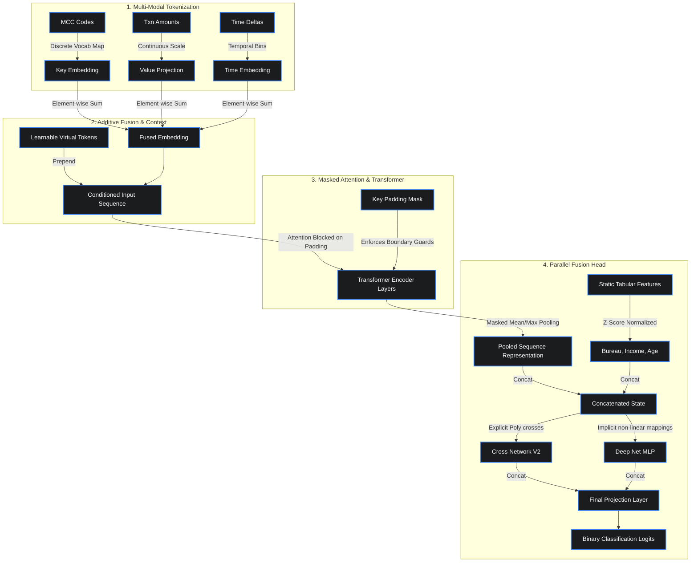

# Large Data Models (LDMs) Research Lab

[](https://www.python.org/)
[](https://pytorch.org/)
[](https://lightning.ai/)
[](#)

Welcome to the **LDM Research Lab**! This repository is a production-grade corporate and research platform designed to pre-train (Self-Supervised Learning) and specialize (Fine-Tuning) **Foundation Models for structured and transactional sequence data**.

Unlike LLMs (which are tailored for natural language), **Large Data Models (LDMs)** natively comprehend numerical, tabular, and temporal sequences without sacrificing mathematical precision or wasting memory on text representation.

---

## 🚀 Quick Start (Running the Pipeline)

The repository includes a synthetic data generator to simulate realistic transaction histories.

### 1. Installation

You can install the package locally or build it via Docker:

**Local Setup:**
```bash
# Clone the repository
git clone <url-to-repo>
cd Large-Data-Models-LDMs-

# Install in editable mode with development extras
pip install -e ".[viz,tracking,peft]"
```

**Docker Setup:**
```bash
docker build -t ldm-research -f docker/Dockerfile .
docker run --gpus all -it ldm-research
```

### 2. Running the End-to-End Pipeline

This runs the complete pipeline:
1. **Generate**: Creates realistic, highly imbalanced synthetic transactional data.
2. **Pre-train**: Performs self-supervised joint-distribution pre-training (using the LimiX masked objective).
3. **Fine-tune**: Merges sequential transaction embeddings with static tabular features using a Deep & Cross Network v2 (DCNv2) to perform fraud classification.
4. **Evaluate**: Computes classification metrics (AUC, F1, Precision, Recall) under clean and adversarial conditions.

```bash
# Run quick verification on CPU (approx. 1-2 minutes)
python src/main.py --config small

# Run full production training (requires GPU)
python src/main.py --config default
```

All checkpoints, configurations, and evaluation metrics are saved to the `results/` directory.

---

## 🧠 Architecture and Data Flow

The core architecture of the LDM combines sequential event tokenization with explicit feature crossing.



### Key Architectural Layers:
1. **Key-Value-Time (KVT) Tokenization**: Instead of flattening transactions into string representations, we isolate Categories (MCC), scalar values (z-score normalized amounts), and temporal rhythms (delta bins) to preserve precision.
2. **Learnable Virtual Tokens**: Acts as continuous prompts prepended to the sequence, conditioning the multi-head attention weights with global contexts (analogous to the `[CLS]` token).
3. **Attention Padding Guardrails**: A boolean `key_padding_mask` filters out padded sequences from both multi-head attention calculations and sequence pooling (Mean/Max), preventing information leakage or dilution.
4. **Parallel Deep & Cross Network (DCNv2)**: Fuses contextual sequential transaction features with z-score normalized static tabular features (e.g., credit score) using explicit polynomial crossing.

---

## 🛡️ Production & Reliability Refactoring Notes

The repository has been updated with strict mathematical and architectural constraints to make it production-ready:

*   **Attention Padding Bug Fix**: In previous versions, sequence collation padded shorter runs with `0`. Since MCC token `0` was mapped to a valid category (`grocery_stores`), the model attended to padding as real purchases. We introduced a `key_padding_mask` to completely isolate padding tokens in the native PyTorch `TransformerEncoder` attention layers.
*   **Masked Pooling Math**: Standard sequence pooling was previously taking a simple average over the padded length, which severely diluted representations for users with short transaction histories. We refactored `mean` and `max` pooling to compute mathematically correct statistics exclusively over active, non-padded token positions.
*   **Static Feature Normalization**: Raw tabular features like `income` (~$100,000) and `bureau_score` (~700) were previously passed directly into DCNv2. Due to the explicit multiplicative crossing, this caused immediate logit explosions (numerical values in the billions). We introduced a standard column-wise z-score normalization step for all static tabular features, stabilizing the loss function.
*   **Robust Test Suite**: Added a comprehensive suite under `tests/test_ldm.py` to assert correct padding isolation, test low-rank vs full-rank DCNv2 crosses, and verify end-to-end lightning pre-training and fine-tuning steps.

---

## 📂 Repository Structure

*   `src/main.py`: Entrypoint orchestrating data creation, pre-training, fine-tuning, and benchmarks.
*   `src/data/`: `LDMDataModule` for data loading, KVT tokenization, and synthetic generation.
*   `src/models/`: Neural components containing the Transformer backbone, virtual token prompts, and DCNv2 head.
*   `src/training/`: Self-supervised pre-training objectives (LimiX) and fine-tuning configurations.
*   `src/evaluation/`: Evaluation metrics (AUC, F1) and out-of-distribution adversarial stress testing (FGSM).
*   `tests/`: Standardized unit tests verifying robustness and accuracy.
